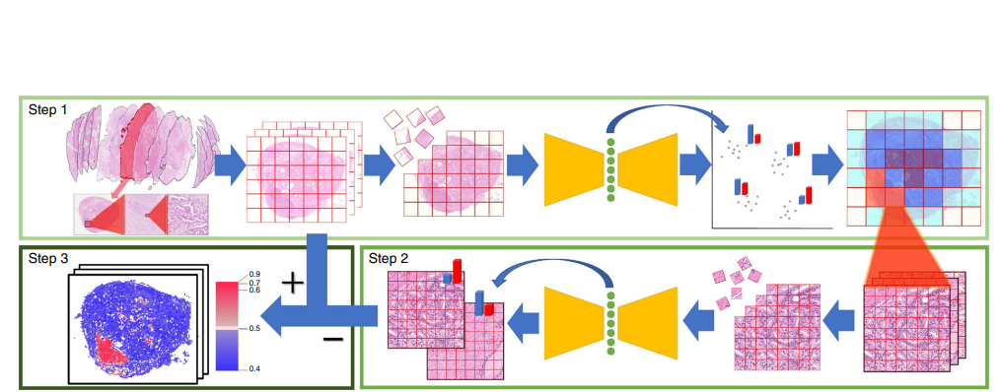

# 題名

Automated acquisition of explainable knowledge from unannotated histopathology images

# MLA

Yamamoto, Yoichiro, et al. "Automated acquisition of explainable knowledge from unannotated histopathology images." Nature communications 10.1 (2019): 5642.

# 出版年

2019

# 構成

Introduction, result, discussion, method, data availability, code availability

# 一言で表現すると

アノテーションなしで学習を行い説明可能性を達成した

# 目的

アノテーションなしのデータ(画像一枚一枚に対して予後年数が存在するが、癌領域などの詳細なアノテーションは存在しない)を用いて説明可能なモデルを構築する

# 手法

